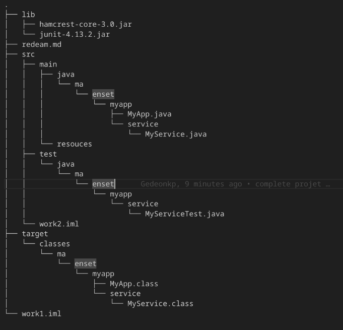

## Structure du projet Java

Pour ce projet, j'ai manuellement créé la structure d’un projet Java que l’on retrouve habituellement lorsqu’on initialise un projet avec Maven, tout en utilisant Java 21. Voici un aperçu de l’organisation du projet :

Les tests unitaires que j’ai développés sont situés dans le répertoire `src/test/`, avec un focus particulier sur la classe `MyService`. Pour cela, j’ai utilisé les bibliothèques **JUnit 4.13.2** et **Hamcrest 3.0**, que j’ai ajoutées manuellement dans le dossier `./lib/`. Cette organisation me permet d’avoir une séparation claire entre le code source, les tests et les dépendances, tout en gardant une structure propre et évolutive.
