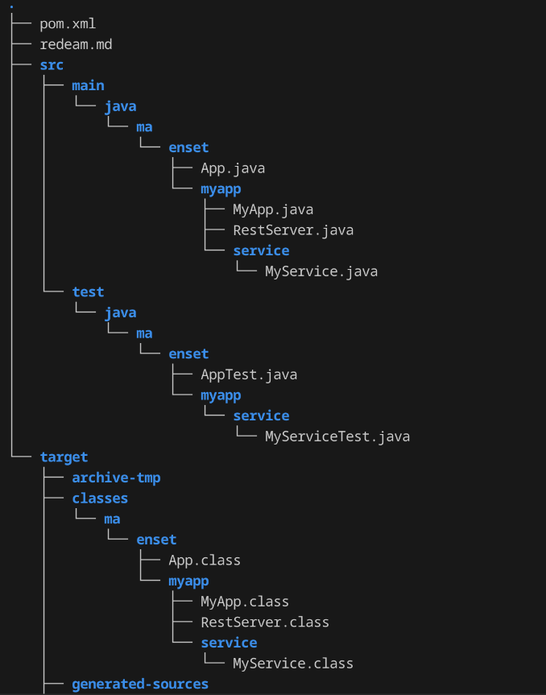
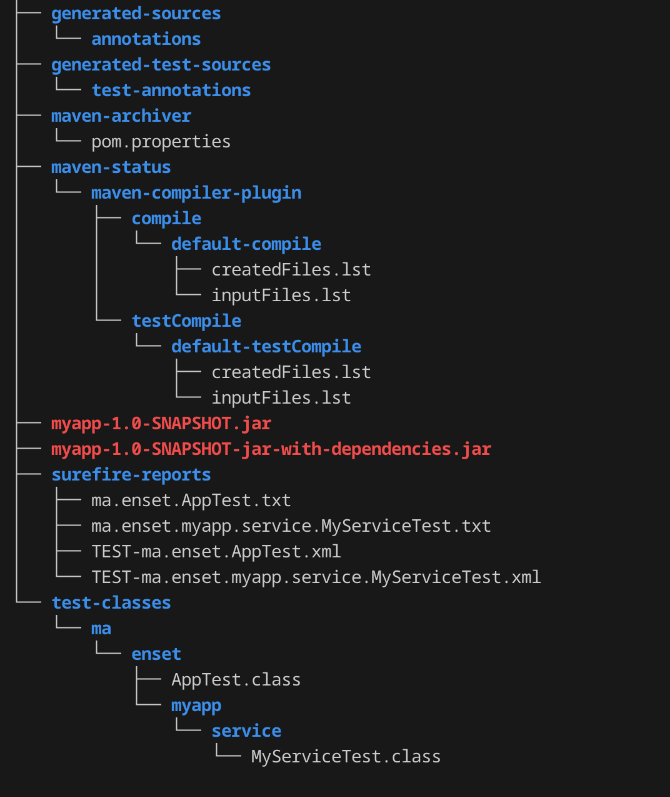

# Documentation du projet Maven

## Structure du projet

Le projet a été généré avec Maven, et toute la structure a été organisée selon les conventions de Maven. 

Voici un aperçu de la structure de base du projet :






## Fichiers JAR

Le projet produit deux fichiers JAR après la compilation :

1. **JAR sans dépendances** : Ce fichier contient uniquement le code du projet, sans les dépendances externes.
   - **Nom** : `[nom-du-projet].jar`
   - Ce fichier peut être utilisé lorsque les dépendances sont gérées séparément.

2. **JAR avec toutes les dépendances** : Ce fichier contient à la fois le code du projet et toutes les dépendances nécessaires à son exécution.
   - **Nom** : `[nom-du-projet]-[version]-with-dependencies.jar`
   - Ce fichier est utile pour déployer facilement l'application sans se soucier des dépendances externes.

## Tests unitaires

Des tests unitaires ont été codés pour assurer la qualité du code et vérifier son bon fonctionnement.

### Commandes Maven utilisées pour la compilation

Pour compiler le projet et générer les fichiers JAR, j'ai utilisé la commande suivante :

```bash
mvn install
